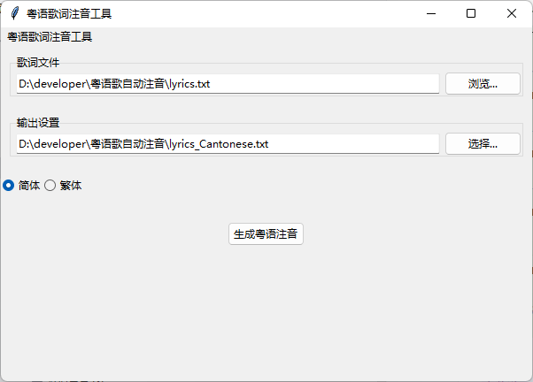

# 粤语歌词注音工具

自动为中文歌词添加粤语发音注音的工具，支持简繁体转换。新增GUI版本！

## 主要功能

- 自动从 shyyp.net 查询粤语发音
- 本地缓存查询结果（`pronunciation_cache.json`）
- 支持简体/繁体歌词输出（默认简体）
- 自动生成带注音的歌词文件

## 安装使用

```bash
# 安装依赖
pip install requests beautifulsoup4 zhconv

# 基础用法（需要先准备 lyrics.txt）
python main.py

# 指定输入文件
python main.py -f 讲不出再见.txt

# 保存为繁体歌词
python main.py -t

# 自定义输出文件
python main.py -o output.txt

# GUI版本用法
python GUI.py
```

## 命令行参数说明

| 参数 | 全称       | 说明                          | 示例                   |
|------|------------|-----------------------------|------------------------|
| -f   | --file     | 输入文件路径（默认lyrics.txt） | -f input.txt          |
| -o   | --output   | 自定义输出文件名               | -o result.txt        |
| -t   | --traditional | 输出繁体歌词（默认简体）        | 无需值，直接添加参数    |
## 使用示例

1. 基础使用：
```bash
python main.py
```
输入文件：`lyrics.txt` → 输出文件：`lyrics_Cantonese.txt`

2. 处理繁体歌词：
```bash
python main.py -f 富士山下.txt -t
```
生成带繁体歌词的 `富士山下_Cantonese.txt`

3. 自定义输出：
```bash
python main.py -f 月半小夜曲.txt -o output.txt
```
强制保存为指定文件名 `output.txt`

## GUI界面说明



1. **文件选择区**：
    - 点击「浏览」按钮选择歌词文件（.txt）
    - 支持手动输入文件路径

2. **输出设置**：
    - 默认自动生成「原文件名_Cantonese.txt」
    - 点击「选择...」自定义保存位置

3. **简繁选项**：
    - 单选按钮切换简体/繁体输出

4. **生成按钮**：
    - 点击「生成粤语注音」开始处理

## 注意事项

1. 需要网络连接用于首次查询发音
2. 自动缓存机制会记住已查询的发音
3. 每次查询间隔0.5秒防止被封禁
4. 繁简转换基于zhconv库的规则实现
5. 输入文件需使用UTF-8编码

## 文件结构
 ├── main.py # 主程序

 ├── lyrics.txt # 默认输入文件

 ├── lyrics_Cantonese.txt # 自动生成的输出文件

 └── pronunciation_cache.json # 发音缓存数据库

## 许可证
[MIT License]()

ps: 由于我本身不会粤语，目前逻辑对于多个粤语发音没有判断机制，默认选取第一个发音。希望大家K歌愉快！

计划支持：GUI版本后续将支持键盘输入或粘贴歌词进行注音。